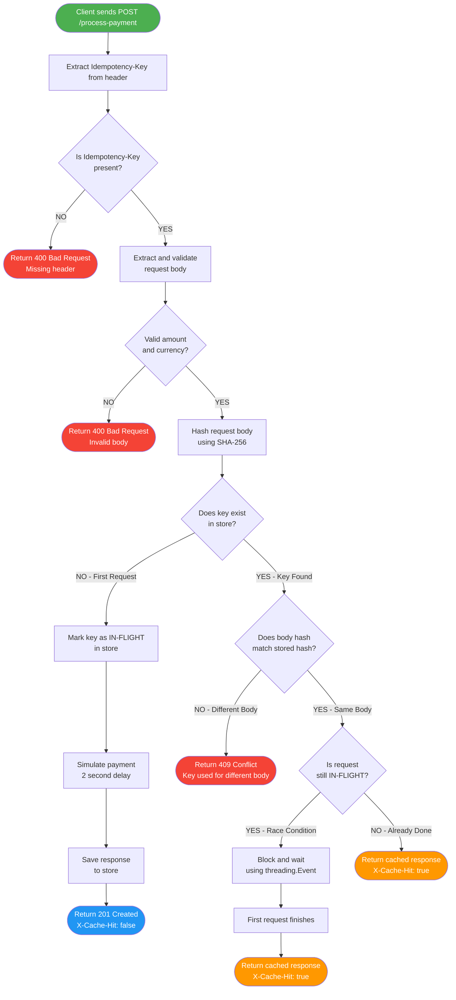

# Idempotency Gateway
### FinSafe Transactions Ltd. — Pay-Once Protocol

A production-quality REST API that guarantees every payment is processed **exactly once**, no matter how many times a client retries the request.

---

## Table of Contents

- [Architecture Diagram](#architecture-diagram)
- [Project Structure](#project-structure)
- [Setup Instructions](#setup-instructions)
- [Running Tests](#running-tests)
- [API Documentation](#api-documentation)
- [Design Decisions](#design-decisions)
- [Developer's Choice — TTL Expiry](#developers-choice--24-hour-ttl-key-expiry)

---

## Architecture Diagram



---

## Setup Instructions

**1. Clone the repository**

```bash
git clone <your-repo-url>
cd idempotency-gateway
```

**2. Create and activate a virtual environment**

```bash
# Windows
python -m venv venv
venv\Scripts\activate

# macOS / Linux
python -m venv venv
source venv/bin/activate
```

**3. Install dependencies**

```bash
pip install -r requirements.txt
```

**4. Start the server**

```bash
python run.py
```

Server runs at `http://127.0.0.1:5000`

---

## Running Tests

```bash
pytest tests/ -v
```

Expected output:

```
tests/test_api.py::test_health_check                               PASSED
tests/test_api.py::test_first_payment_returns_201_and_cache_miss   PASSED
tests/test_api.py::test_duplicate_request_returns_cached_response  PASSED
tests/test_api.py::test_same_key_different_body_returns_409        PASSED
tests/test_api.py::test_missing_idempotency_key_returns_400        PASSED
tests/test_api.py::test_invalid_amount_returns_400                 PASSED
tests/test_api.py::test_missing_body_fields_returns_400            PASSED

7 passed in Xs
```

---

## API Documentation

### Endpoints

| Method | Endpoint           | Description                       |
| ------ | ------------------ | --------------------------------- |
| GET    | `/health`          | Liveness check                    |
| POST   | `/process-payment` | Submit a payment with idempotency |

---

### POST `/process-payment`

#### Request Headers

| Header            | Required | Description                                    |
| ----------------- | -------- | ---------------------------------------------- |
| `Content-Type`    | Yes      | Must be `application/json`                     |
| `Idempotency-Key` | Yes      | A unique string (UUID recommended) per payment |

#### Request Body

```json
{
  "amount": 100,
  "currency": "GHS"
}
```

| Field      | Type   | Required | Description                       |
| ---------- | ------ | -------- | --------------------------------- |
| `amount`   | number | Yes      | Payment amount — must be positive |
| `currency` | string | Yes      | Currency code, e.g. `"GHS"`       |

#### Response Headers

| Header        | Value   | Meaning                                      |
| ------------- | ------- | -------------------------------------------- |
| `X-Cache-Hit` | `false` | Payment was freshly processed                |
| `X-Cache-Hit` | `true`  | Response was replayed from cache (duplicate) |

#### Response Codes

| Status Code                 | When it occurs                                    |
| --------------------------- | ------------------------------------------------- |
| `201 Created`               | Payment processed successfully (first request)    |
| `201 Created`               | Duplicate request — cached response replayed      |
| `400 Bad Request`           | Missing header, missing fields, or invalid amount |
| `409 Conflict`              | Same key reused with a different request body     |
| `500 Internal Server Error` | Payment processing failed — safe to retry         |

---

### Example Requests

#### User Story 1 — First Payment (Happy Path)

```bash
curl -X POST http://127.0.0.1:5000/process-payment \
  -H "Content-Type: application/json" \
  -H "Idempotency-Key: a1b2c3d4-e5f6-7890-abcd-ef1234567890" \
  -d '{"amount": 100, "currency": "GHS"}'
```

Response — `201 Created`, `X-Cache-Hit: false`:

```json
{
  "message": "Charged 100 GHS",
  "status": "success",
  "transaction_id": "3f2504e0-4f89-11d3-9a0c-0305e82c3301",
  "timestamp": "2025-07-10T14:32:00.123456+00:00"
}
```

---

#### User Story 2 — Duplicate Request (same key, same body)

```bash
curl -X POST http://127.0.0.1:5000/process-payment \
  -H "Content-Type: application/json" \
  -H "Idempotency-Key: a1b2c3d4-e5f6-7890-abcd-ef1234567890" \
  -d '{"amount": 100, "currency": "GHS"}'
```

Response — `201 Created`, `X-Cache-Hit: true`, same `transaction_id`, returned instantly (no 2s delay):

```json
{
  "message": "Charged 100 GHS",
  "status": "success",
  "transaction_id": "3f2504e0-4f89-11d3-9a0c-0305e82c3301",
  "timestamp": "2025-07-10T14:32:00.123456+00:00"
}
```

---

#### User Story 3 — Same Key, Different Body (Conflict)

```bash
curl -X POST http://127.0.0.1:5000/process-payment \
  -H "Content-Type: application/json" \
  -H "Idempotency-Key: a1b2c3d4-e5f6-7890-abcd-ef1234567890" \
  -d '{"amount": 500, "currency": "GHS"}'
```

Response — `409 Conflict`:

```json
{
  "error": "Idempotency key already used for a different request body."
}
```

---

#### Health Check

```bash
curl http://127.0.0.1:5000/health
```

Response — `200 OK`:

```json
{
  "status": "ok"
}
```

---

## Design Decisions

### SHA-256 Body Hashing

Instead of storing the raw request body and comparing strings, the body is hashed with SHA-256 (`utils.hash_body()`). This produces a compact 64-character fingerprint that is fast to compare and consistent regardless of body size. `json.dumps(..., sort_keys=True)` is used before hashing so that `{"amount":100,"currency":"GHS"}` and `{"currency":"GHS","amount":100}` produce the **same hash** — preventing false conflict errors caused by key ordering differences.

### threading.Event for Race Conditions

When two identical requests arrive simultaneously, the second request must not start a new payment process. A `threading.Event` is stored alongside each in-flight entry. The second request calls `event.wait()`, which **blocks the thread efficiently** (no busy-waiting / polling) until the first request calls `event.set()` after saving its response. The second request then reads the completed result and returns it with `X-Cache-Hit: true`.

### Delete on Failure

If the payment processing step raises an exception, the idempotency key is **deleted from the store** (`idempotency_store.delete()`). This is intentional — a failed payment should not be cached. The client can safely retry with the same key and it will be treated as a fresh request, giving the payment a second chance to succeed.

### In-Memory Store (No External Dependencies)

The store is a plain Python dictionary protected by a `threading.Lock`. This keeps the project self-contained with zero infrastructure requirements — no Redis, no database needed to run or test it. In a production system, this would be replaced with Redis (using `SET NX` + `EXPIRE`) to support horizontal scaling across multiple server instances.

---

## Developer's Choice — 24-Hour TTL Key Expiry

### What it does

Every idempotency key entry records a `created_at` Unix timestamp when it is first stored. On every `store.get()` call, the age of the entry is calculated:

```python
age_in_seconds = time.time() - entry["created_at"]
if age_in_seconds > TTL_SECONDS:   # TTL_SECONDS = 86400 (24 hours)
    del self._store[idempotency_key]
    return None  # Treat as a brand-new request
```

If the entry is older than 24 hours, it is deleted and the request is processed as a fresh payment.

### Why it matters in real Fintech

| Problem without TTL           | Solution with TTL                                      |
| ----------------------------- | ------------------------------------------------------ |
| Store grows indefinitely      | Expired keys are deleted automatically on lookup       |
| Memory leak crashes server    | Memory stays bounded — old keys are cleaned up         |
| Stale keys block new payments | After 24h, the same key can be reused for a new charge |

Idempotency keys are designed to protect against **short-term network retries** (seconds to minutes), not permanent deduplication. After 24 hours, it is safe to assume a retry is a genuinely new payment intent, not an accidental duplicate. This matches the TTL policies used by Stripe and Paystack in their production idempotency implementations.

---

## Author

Built for FinSafe Transactions Ltd. Backend Engineering Assessment.
