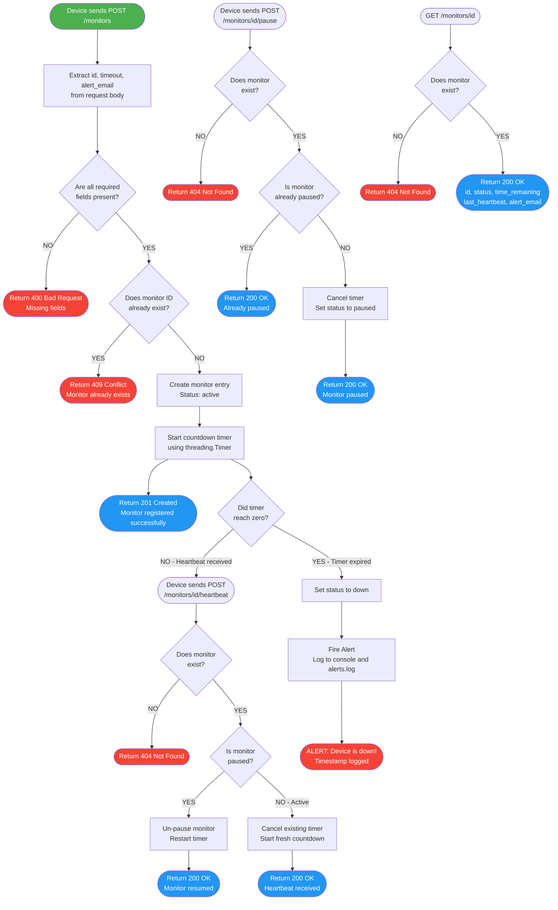

# Pulse-Check API — Watchdog Sentinel
### CritMon Servers Inc. — Dead Man's Switch Protocol

A production-quality REST API that monitors critical infrastructure devices (solar farms, weather stations, pump relays). Each device registers a countdown timer. If the device fails to send a heartbeat before the timer expires, the system fires an alert. The device must keep checking in — or the alarm sounds.

---

## Architecture Diagram




## Monitor State Diagram

```
                    POST /monitors
                         |
                         v
                    ┌─────────┐
                    │  ACTIVE │ ◄─────────────────────────────┐
                    └────┬────┘                               │
                         |                                    │
          ┌──────────────┼──────────────┐                     │
          |              |              |                     │
          v              v              v                     │
   timeout expires  POST /pause   POST /heartbeat             │
          |              |         (resets timer)             │
          v              v                                    │
       ┌──────┐      ┌────────┐                               │
       │ DOWN │      │ PAUSED │                               │
       └──────┘      └───┬────┘                               │
    (alert fired)        |                                    │
                         | POST /heartbeat                    │
                         | (auto un-pause)                    │
                         └────────────────────────────────────┘
```

---

## Project Structure

```
pulse-check-api/
├── app/
│   ├── __init__.py        # Flask app factory
│   ├── routes.py          # All endpoints and request handling
│   ├── monitor_store.py   # MonitorStore — thread-safe state storage
│   ├── watchdog.py        # WatchdogTimer — background threading.Timer logic
│   └── utils.py           # utc_now(), log_alert(), format_monitor_response()
├── tests/
│   └── test_api.py        # 10 pytest tests covering all user stories
├── .gitignore
├── requirements.txt
├── run.py                 # Entry point
└── README.md
```

---

## Setup Instructions

**1. Clone the repository**
```bash
git clone https://github.com/NdatimanaAssa/AmaliTech-DEG-Project-based-challenges.git
cd pulse-check-api
```

**2. Create and activate a virtual environment**
```bash
# Windows
python -m venv venv
venv\Scripts\activate

# macOS / Linux
python -m venv venv
source venv/bin/activate
```

**3. Install dependencies**
```bash
pip install -r requirements.txt
```

**4. Start the server**
```bash
python run.py
```

Server starts at `http://127.0.0.1:5001`

---

## Running Tests

```bash
pytest tests/ -v
```

Expected output:
```
tests/test_api.py::test_register_monitor_returns_201                    PASSED
tests/test_api.py::test_duplicate_registration_returns_409              PASSED
tests/test_api.py::test_heartbeat_on_existing_monitor_returns_200       PASSED
tests/test_api.py::test_heartbeat_on_missing_monitor_returns_404        PASSED
tests/test_api.py::test_pause_active_monitor_returns_200                PASSED
tests/test_api.py::test_pause_already_paused_monitor_returns_200_with_message  PASSED
tests/test_api.py::test_heartbeat_on_paused_monitor_unpauses_it         PASSED
tests/test_api.py::test_get_monitor_returns_correct_fields              PASSED
tests/test_api.py::test_get_nonexistent_monitor_returns_404             PASSED
tests/test_api.py::test_missing_required_fields_returns_400             PASSED

10 passed in Xs
```

---

## API Documentation

### Endpoints

| Method | Endpoint                        | Description                              |
|--------|---------------------------------|------------------------------------------|
| GET    | `/health`                       | Liveness check                           |
| POST   | `/monitors`                     | Register a new monitor                   |
| POST   | `/monitors/{id}/heartbeat`      | Reset the countdown timer                |
| POST   | `/monitors/{id}/pause`          | Pause the countdown (no alerts)          |
| GET    | `/monitors/{id}`                | Get current monitor state                |

---

### POST `/monitors` — Register a Monitor

**Request Body:**
```json
{
  "id": "solar-farm-01",
  "timeout": 60,
  "alert_email": "ops@critmon.com"
}
```

| Field         | Type   | Required | Description                          |
|---------------|--------|----------|--------------------------------------|
| `id`          | string | Yes      | Unique device identifier             |
| `timeout`     | number | Yes      | Countdown duration in seconds        |
| `alert_email` | string | Yes      | Email to notify when device goes down|

**curl:**
```bash
curl -X POST http://127.0.0.1:5001/monitors \
  -H "Content-Type: application/json" \
  -d '{"id": "solar-farm-01", "timeout": 60, "alert_email": "ops@critmon.com"}'
```

**Response `201 Created`:**
```json
{
  "message": "Monitor 'solar-farm-01' registered. Countdown started for 60s.",
  "id": "solar-farm-01"
}
```

---

### POST `/monitors/{id}/heartbeat` — Reset Timer

**curl:**
```bash
curl -X POST http://127.0.0.1:5001/monitors/solar-farm-01/heartbeat
```

**Response `200 OK`:**
```json
{
  "message": "Monitor 'solar-farm-01' heartbeat received — timer reset.",
  "id": "solar-farm-01"
}
```

**Response `404` (unknown ID):**
```json
{ "error": "Monitor 'solar-farm-01' not found." }
```

---

### POST `/monitors/{id}/pause` — Pause Countdown

**curl:**
```bash
curl -X POST http://127.0.0.1:5001/monitors/solar-farm-01/pause
```

**Response `200 OK`:**
```json
{
  "message": "Monitor 'solar-farm-01' paused. No alerts will fire.",
  "id": "solar-farm-01"
}
```

**Response `200 OK` (already paused):**
```json
{
  "message": "Monitor is already paused",
  "id": "solar-farm-01"
}
```

---

### GET `/monitors/{id}` — Get Monitor Status

**curl:**
```bash
curl http://127.0.0.1:5001/monitors/solar-farm-01
```

**Response `200 OK`:**
```json
{
  "id": "solar-farm-01",
  "status": "active",
  "timeout": 60,
  "alert_email": "ops@critmon.com",
  "time_remaining": 47.83,
  "registered_at": "2025-07-10T14:00:00.000000+00:00",
  "last_heartbeat": "2025-07-10T14:00:12.000000+00:00"
}
```

| Field            | Description                                          |
|------------------|------------------------------------------------------|
| `status`         | `"active"`, `"paused"`, or `"down"`                  |
| `time_remaining` | Seconds left on the countdown (0 if paused or down)  |
| `last_heartbeat` | Timestamp of last heartbeat, or `null` if none sent  |

---

### Alert Output (when timer expires)

Printed to console and written to `alerts.log`:
```json
{"ALERT": "Device solar-farm-01 is down!", "time": "2025-07-10T14:01:00.000000+00:00"}
```

---

## Design Decisions

### threading.Timer
Each monitor gets its own `threading.Timer` object. When the timer fires, it calls `_on_expiry()` in a background daemon thread — completely non-blocking for the main Flask request thread. Using `threading.Timer` is the correct tool here because each monitor has an independent, cancellable countdown. The alternative (a single polling loop checking all monitors) would be less precise and harder to cancel cleanly.

### threading.Lock
All reads and writes to the `MonitorStore._monitors` dictionary are wrapped in a `threading.Lock`. Without this, two simultaneous heartbeat requests for the same monitor could both read the old timer, both cancel it, and both create new timers — resulting in two active timers for one monitor and a guaranteed false alert. The lock ensures only one thread modifies state at a time.

### How Pause Works
Pausing calls `timer.cancel()` on the active `threading.Timer` and sets `deadline = None`. The monitor entry is kept in the store so its configuration is preserved. When a heartbeat arrives on a paused monitor, a brand-new timer is created from the full timeout — the remaining time before the pause is intentionally discarded, giving the device a clean fresh window.

### Delete on Expiry vs Keep Entry
When a monitor expires, the entry is kept in the store with `status = "down"`. This is intentional — operators need to be able to query `GET /monitors/{id}` and see that a device went down, rather than getting a 404. The entry serves as an audit record.

---

## Developer's Choice — GET /monitors/{id} Status Endpoint

### What it does
Returns a real-time snapshot of a monitor's full state including a live-calculated `time_remaining` field. The `time_remaining` is computed at request time as `deadline - time.time()`, so it always reflects the actual seconds left on the countdown — not a cached value.

### Why it is critical for real infrastructure monitoring
Without a status endpoint, the monitoring system is a black box. Operators have no way to answer basic questions like:

- "Is device X still active or has it gone down?"
- "How many seconds are left before the alert fires?"
- "When did we last hear from this device?"
- "Is this monitor paused for maintenance or genuinely offline?"

In a real Fintech or infrastructure context, this endpoint feeds dashboards (Grafana, Datadog), powers on-call alerting tools, and is the first thing an engineer checks during an incident. It also enables health-check scripts to poll the API and trigger escalations before the timer even expires — a proactive rather than reactive monitoring posture.

---

## Author
Built for CritMon Servers Inc. Backend Engineering Assessment.
